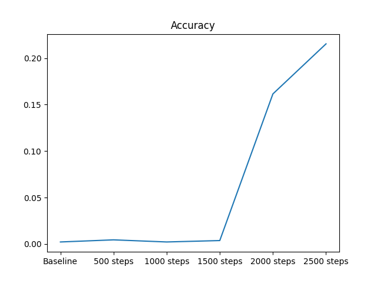

# This is a demonstration on using GRPO styled reinforcement learning to fine tune a model 
[Unsloth's implementation](https://docs.unsloth.ai/basics/reasoning-grpo-and-rl) has made this incredibly simple. By using both PEFT, LORA (Q4) and pre-trained reasoning models, you can fine tune it for any reasonably difficult task for the model size. 

In this demo I fine tuned it on GSM8k (a dataset it has seen before) but fine tuned it for a different answering format.

This was done on a single 4090 over ¬30 hours. Results in 2500 steps (before I got kicked off UCL GPUs :pensive:):




## Installation
```
conda create -n grpo # note 1
pip install unsloth vllm matplotlib pandas huggingface_hub[cli]
huggingface login # note 2 

# note 1: unsloth requires python>=3.10
# note 2: if you want to upload model later remember to select specific repo to give write permissions to
```


## Train and evaluate
### Train

```continued_distilled_grpo_training.py```


### Eval

```python continued_distilled_grpo_test.py```

## Pretrained checkpoint
https://huggingface.co/yeok/DeepScaleR-1.5B-Preview-GSM8K-Demo

## Uploading models

```model.push_to_hub('<repo>/<model>', commit_message=<commit_message>)```